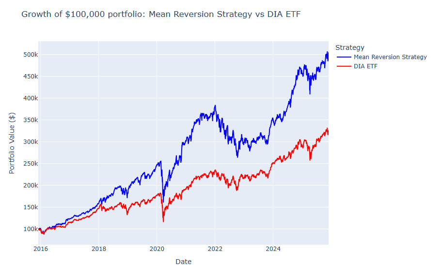

 

---

#  **Dow Jones Mean Reversion Backtesting Engine**

This project implements a Python-based backtesting engine to evaluate a mean‑reversion trading strategy on Dow Jones Industrial Average (DJIA) constituents. It automates data ingestion, portfolio construction, performance calculation, and visualization — producing reproducible, publication‑ready outputs suitable for financial analysis and portfolio research.

---

##  **Project Overview**

Financial analysts often need to evaluate how a strategy would have performed historically. This project demonstrates an end‑to‑end workflow:

- Extract DJIA constituents  
- Download historical price data  
- Construct a systematic mean‑reversion strategy  
- Benchmark against the DIA ETF  
- Compute performance metrics (CAGR, volatility, Sharpe ratio)  
- Generate both static and interactive visualizations  

The goal is to showcase practical skills in financial modeling, Python, and data-driven investment research.

---

##  **Repository Structure**

```
stock_mean_reversion_backtesting/
│   Backtesting Final.py
│   dow_jones_constituents.csv
│   dow_jones_data.csv
│   README.md
│
└── docs/
    └── backtesting/
        index.html
        backtesting-results.png
        line_chart.html
        performance_metrics.csv
```

---

##  **Results**

### **Cumulative Performance: Mean Reversion Strategy vs DIA ETF**

This chart shows the growth of a $100,000 portfolio from 2016–2025.  
The mean‑reversion strategy significantly outperformed the DIA ETF benchmark over the period.



---

### **Key Performance Metrics**

| Strategy          | Annualized Return | Volatility | Sharpe Ratio |
|------------------|------------------:|-----------:|-------------:|
| Mean Reversion   | 19.77%            | 20.11%     | 0.98         |
| DIA ETF          | 14.69%            | 17.47%     | 0.84         |

These results highlight the potential value of systematic rebalancing based on short-term price deviations.
### **Interactive Chart**

An interactive version of the performance chart is available here:

```
docs/backtesting/line_chart.html
```

---

##  **Methodology**

### **Data**
- Historical daily adjusted close prices for all DJIA constituents  
- Ticker list extracted automatically from a public source  

### **Strategy Logic**
The implemented strategy:

- Identifies short-term price deviations  
- Allocates capital toward underperforming constituents  
- Rebalances daily  
- Benchmarks against the DIA ETF  

The framework is modular and can be extended to:

- Factor strategies (value, momentum, quality)  
- Sector rotation  
- Volatility targeting  
- Macro‑driven signals  

---

##  **How to Run the Backtest**

### **1. Install dependencies**
```
pip install pandas numpy matplotlib yfinance
```

### **2. Run the script**
```
python "Backtesting Final.py"
```

### **3. View results**
Outputs are saved automatically to:

```
docs/backtesting/
```

including:

- `backtesting-results.png`  
- `line_chart.html`  
- `performance_metrics.csv`  

---

## 🔮 **Future Improvements**

- Add transaction cost modeling  
- Introduce factor-based strategies  
- Implement volatility targeting or risk parity  
- Build a Streamlit dashboard for interactive exploration  
- Integrate macroeconomic indicators for signal generation  

---

##  **Live Project Page**

A polished GitHub Pages version of this project is available at:

```
https://<your-username>.github.io/stock_mean_reversion_backtesting/backtesting/](https://cl0110.github.io/stock_mean_reversion_backtesting/
```

(Replace `<your-username>` with your GitHub username.)

---

##  **Contact**

If you’d like to discuss this project or explore more of my work, feel free to reach out.
claire.lee.bolam@gmail.com

---


